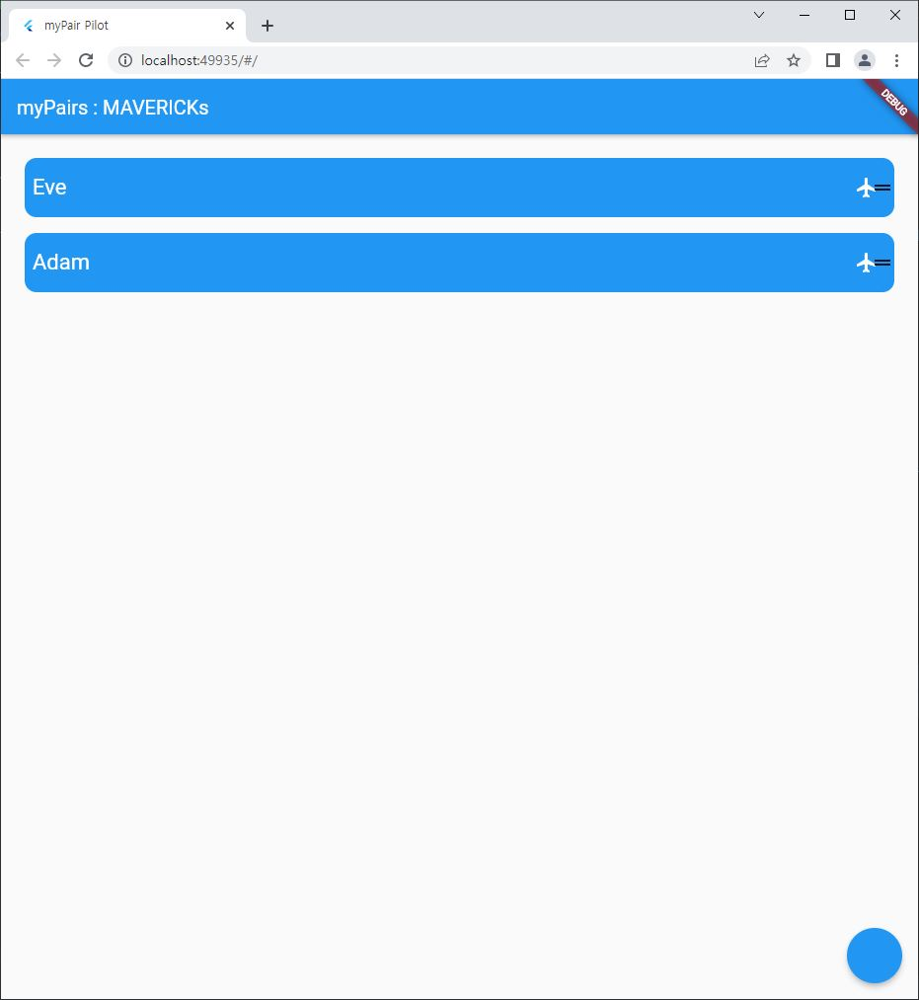

# Project Name : myPair Pilot [IN PROGRESS]
it is not the plan, it is the pair

# Overview

# Target : issues of myPairs
MAVERICK's Issues

# myApproach : myPair Pilot Service
I am not a teacher, I am a Goose. My Legacy will make MAVERICK TOPGUN at last.

## Functions
Leaving Legacy of Goose that will guide myPair, Think in perspective of myPair.

Improving Openness to experience of [Big Five personality traits](https://en.wikipedia.org/wiki/Big_Five_personality_traits)

# Implementation
client ; flutter ; todolist => myPairIssues

REST API ; Spring Framework ; SpringMVC prj with Maven, Oracle Compute Instance, ATP DB

ex)

http://193.123.224.216:8080/pair/v/msg

http://193.123.224.216:8080/pair/v/p

http://193.123.224.216:8080/pair/v/pi

*As long as Oracle's always free exist, Pair Pilot exists.

# Appendix
[Teacher Said 'Linux is /, Window is \', BUT Pair said, 'It's OK, Let's See']

# Expansion
1. Find another Goose's service corresponding to myPairPilot Service and Check
2. Android client + REST API

# Background
TOPGUN:MAVERICK ; [link](https://namu.wiki/w/%ED%83%91%EA%B1%B4(%EC%98%81%ED%99%94))

# References

1. flutter setting1 - https://www.youtube.com/watch?v=usE9IKaogDU

2. flutter setting2 - https://blog.naver.com/chandong83/221832416217

3. https://stackoverflow.com/questions/60409417/how-to-read-http-response-from-flutter

4. flutter's ToDoList => myPairIssues - https://github.com/thecodingpapa/todo_hive

5. Error: XMLHttpRequest error. - https://www.youtube.com/watch?v=sywkZRvnTP8

6. flutter tutorial ; get http - https://flutter-ko.dev/docs/cookbook/networking/fetch-data
 => there is problem ; ?, required, but !

7.?